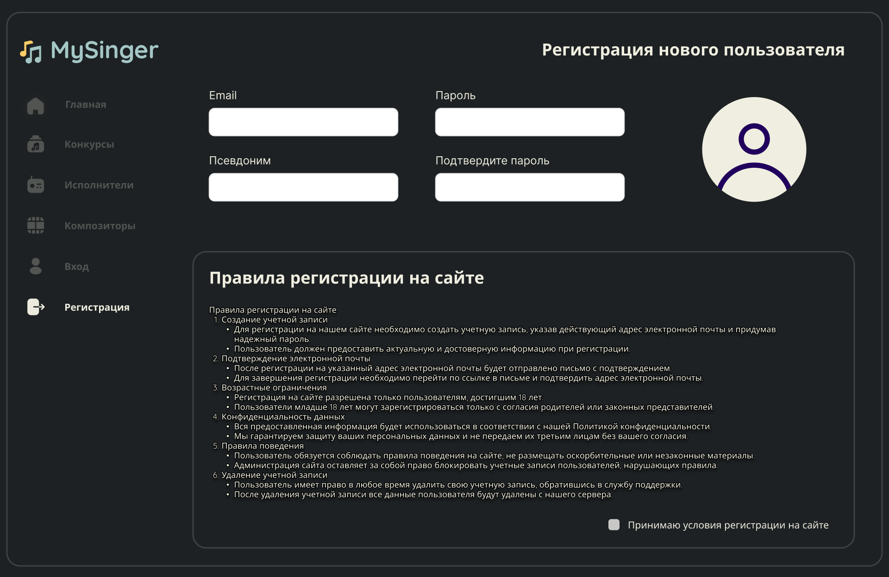
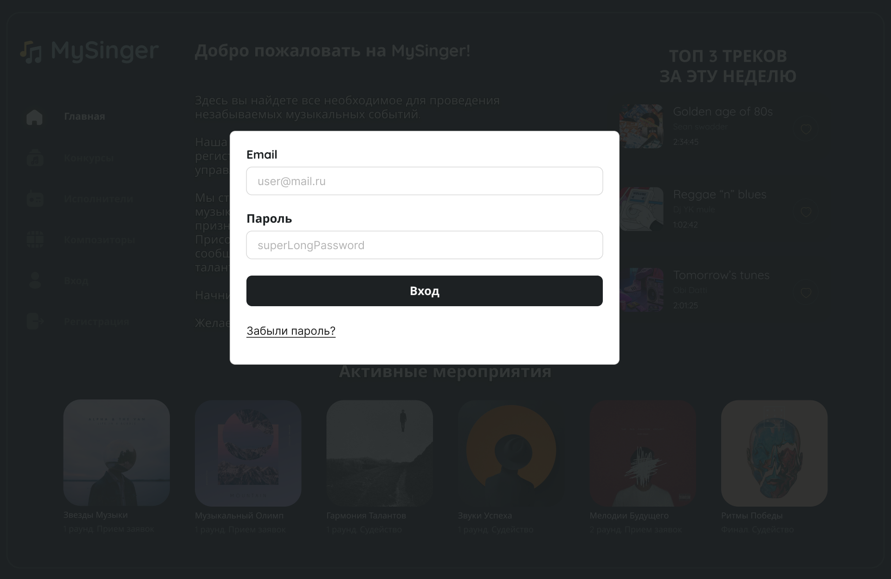
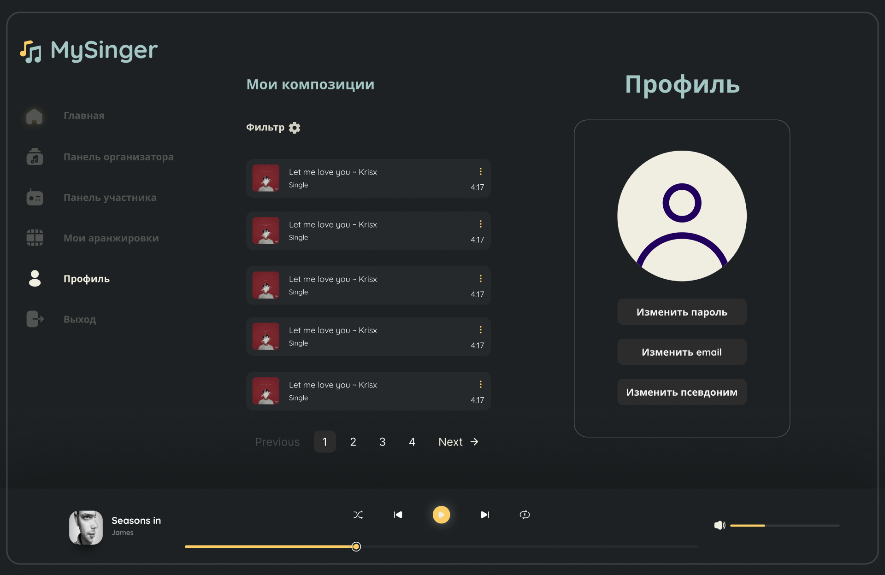
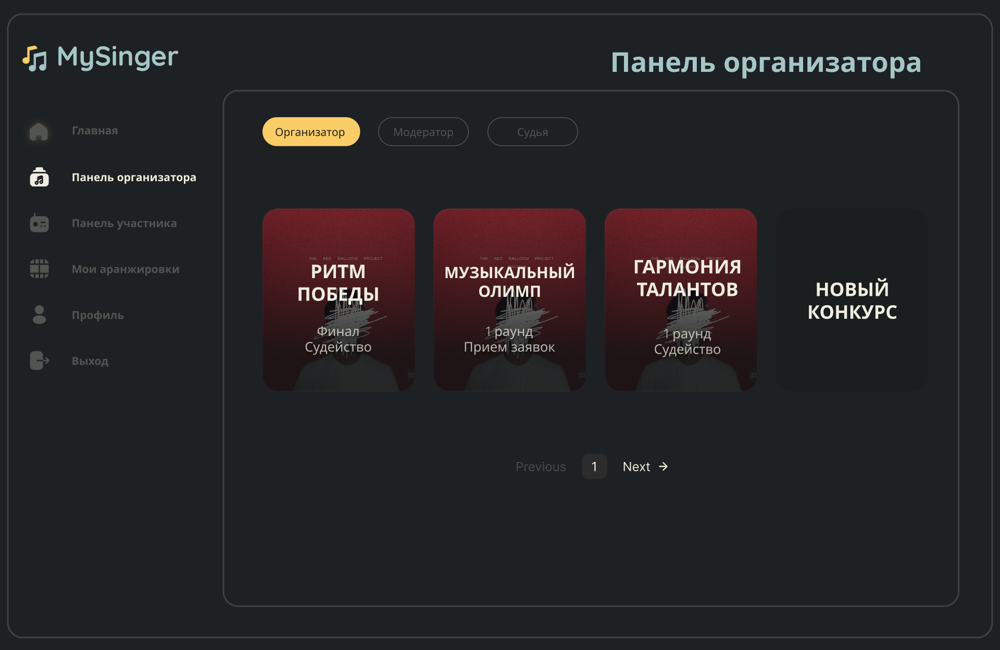
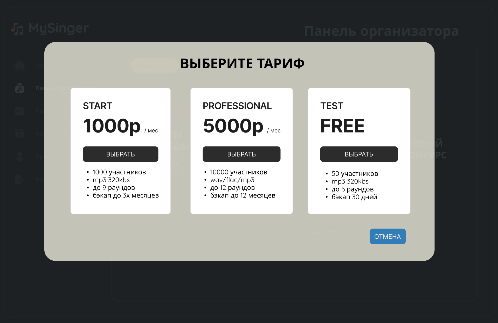

# my-singer

Учебный проект курса
[Kotlin Backend Developer](https://otus.ru/lessons/kotlin/).
Поток курса 2024-05.

my-singer - это онлайн-площадка для проведения музыкальных конкурсов с функциями социальной сети для музыкантов.
Площадка позволяет организаторам таких онлайн-мероприятий в удобном интерфейсе организовать конкурс, назначать 
судейскую коллегию, правила оценки работ и определения победителя на каждом этапе. 
Для участников этих мероприятий будет удобный интерфейс для поиска активных мероприятий и сдачи своих работ на них. 
Так же будет доступна система рейтингов как самих мероприятий, так и участников, которые занимают на этих 
мероприятиях призовые места.
Так же будет добавлена возможность просмотра профилей музыкантов, и возможность комментирования работ как в рамках 
конкурсов, так и на странице музыкантов. 

Для организаторов будет предусмотрено несколько тарифов в зависимости от максимального количества участников и 
требований к загружаемым работам. 

## Визуальная схема фронтенда

### Главная страница

### Страница "Регистрация"

### Модальное окно "Вход"

### Страница "Профиль"

### Страница "Панель организатора"

### Модульное окно "Создание конкурса ШАГ-1(Выбор тарифа)"

### Страница "Создание конкурса ШАГ-2(Правила)"

### Страница "Создание конкурса ШАГ-3(Подробное описание мероприятия, дата начала-завершения приема работ и пр.)"

### Страница "Конкурсы(Участник)"

### Страница "Исполнители"

### Шаблон страницы "КОНКУРС"

### Шаблон страницы "РЕДАКТИРОВАТЬ КОНКУРС"

### Шаблон страницы "НАЗНАЧЕНИЕ РОЛЕЙ"

### Шаблон страницы "ТУРНИРНАЯ ТАБЛИЦА(ОТБОРОЧНЫЕ ЭТАПЫ)"

### Шаблон страницы "ТУРНИРНАЯ ТАБЛИЦА(ТАБЛИЦА РАУНДОВ)"

### Шаблон страницы "ПРОСМОТР КОМПОЗИЦИИ/ПАРЫ" (УЧАСТНИК/ЗРИТЕЛЬ)

### Шаблон страницы "ПРОСМОТР КОМПОЗИЦИИ/ПАРЫ" (АДМИНИСТРАТОР/СУДЬЯ)

### Шаблон модального окна "ОЦЕНКИ" (УЧАСТНИК/ЗРИТЕЛЬ)

### Шаблон модального окна "ОЦЕНКИ" (АДМИНИСТРАТОР/СУДЬЯ)

## Документация

1. Маркетинг и аналитика
    1. [Целевая аудитория](./docs/01-biz/01-target-audience.md)
    2. [Заинтересанты](./docs/01-biz/02-stakeholders.md)
    3. [Пользовательские истории](./docs/01-biz/03-bizreq.md)
2. Аналитика:
    1. [Функциональные требования](./docs/02-analysis/01-functional-requiremens.md)
    2. [Нефункциональные требования](./docs/02-analysis/02-nonfunctional-requirements.md)
3. DevOps
4. Архитектура
5. Тесты

# Структура проекта
